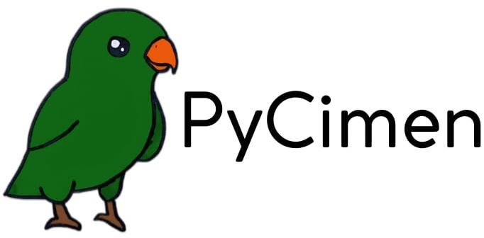

<div>
  
  <h1>PyCimen Language</h1>
</div>

Python interpreter implemented in C++ offers developers a versatile and extensible tool for executing Python code. This approach fosters deeper understanding of the language's inner workings and encourages contributions to the open-source Python ecosystem.

## Project Overview

The Python Interpreter project aims to develop a fully functional interpreter for the Python programming language from scratch, using C++ as the implementation language. This project serves as an impressive demonstration of technical expertise and deep understanding of both Python and C++.

### This project delves into the heart of Python by crafting a custom interpreter built in C++.

   + Language Parsing: The interpreter includes a robust parser capable of parsing Python source code and generating an abstract syntax tree (AST) representation.

   + Lexical Analysis: A comprehensive lexer/tokenizer module is implemented to break down the input source code into tokens, facilitating the subsequent parsing and interpretation stages.

   + Semantic Analysis: The interpreter performs semantic analysis on the parsed AST to detect and report any language-specific errors, such as undeclared variables or type mismatches.

   + Execution Engine: A powerful execution engine is designed to execute the parsed Python code, implementing the language's semantics and executing statements, expressions, and control flow constructs.

   + Standard Library Support: Efforts are made to provide support for a subset of Python's standard library modules, enabling the interpreter to execute a wide range of Python programs.

### Why This Project Matters

   * Become a Language Whisperer: Crafting a Python interpreter from scratch equips you with an intimate understanding of programming languages, their design principles, and the intricate workings of compilers and interpreters. It showcases your prowess in tackling complex projects and makes you a valuable asset to potential employers and collaborators.

   * Technical Virtuosity: This project offers a hands-on playground to hone your skills in language parsing, lexical analysis, semantic analysis, and execution engine design. These are highly sought-after skills in software development, particularly in areas like language design, compiler development, and performance optimization.

   * Level Up Your Curriculum: Adding this project to your resume or portfolio is a bold declaration of your dedication to continuous learning and mastery of advanced programming concepts. It sets you apart from the crowd and signals your passion for exploring the intricacies of computer science.

## Building

```bash
$ git clone https://github.com/elif1906/Pycimen
$ cd pycimen
$ make

```
## Running Tests

```bash
  $ make test
```

## File Running
# for window users
```bash
$ pycimen [filename.pcl]  
$ pycimen --version

```
# for linux/macos users
```bash
$ ./pycimen [filename.pcl]  
$ ./pycimen --version

```


This is a [Next.js](https://nextjs.org/) project bootstrapped with [`create-next-app`](https://github.com/vercel/next.js/tree/canary/packages/create-next-app).

## Getting Started

First, run the development server:

```bash
npm run dev
# or
yarn dev
# or
pnpm dev
# or
bun dev
```

Open [http://localhost:3000](http://localhost:3000) with your browser to see the result.

You can start editing the page by modifying `app/page.tsx`. The page auto-updates as you edit the file.

This project uses [`next/font`](https://nextjs.org/docs/basic-features/font-optimization) to automatically optimize and load Inter, a custom Google Font.

## Learn More

To learn more about Next.js, take a look at the following resources:

- [Next.js Documentation](https://nextjs.org/docs) - learn about Next.js features and API.
- [Learn Next.js](https://nextjs.org/learn) - an interactive Next.js tutorial.

You can check out [the Next.js GitHub repository](https://github.com/vercel/next.js/) - your feedback and contributions are welcome!

## Deploy on Vercel

The easiest way to deploy your Next.js app is to use the [Vercel Platform](https://vercel.com/new?utm_medium=default-template&filter=next.js&utm_source=create-next-app&utm_campaign=create-next-app-readme) from the creators of Next.js.

Check out our [Next.js deployment documentation](https://nextjs.org/docs/deployment) for more details.
